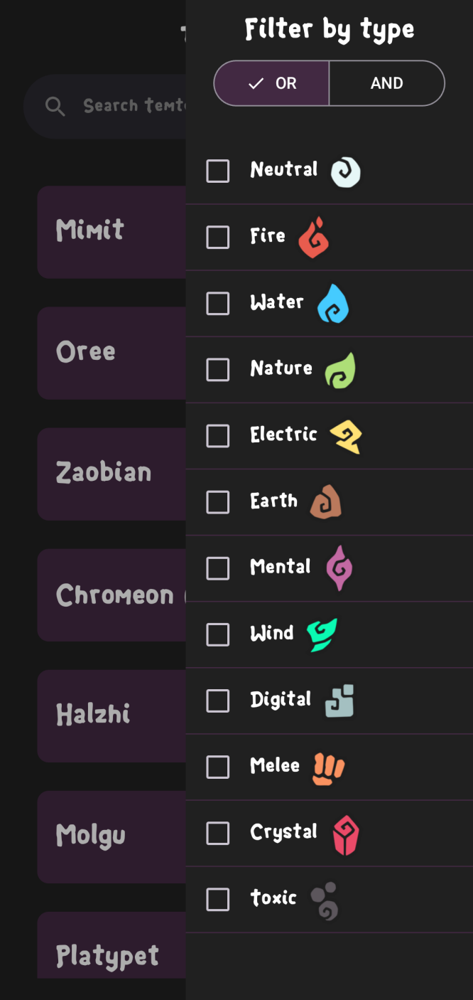
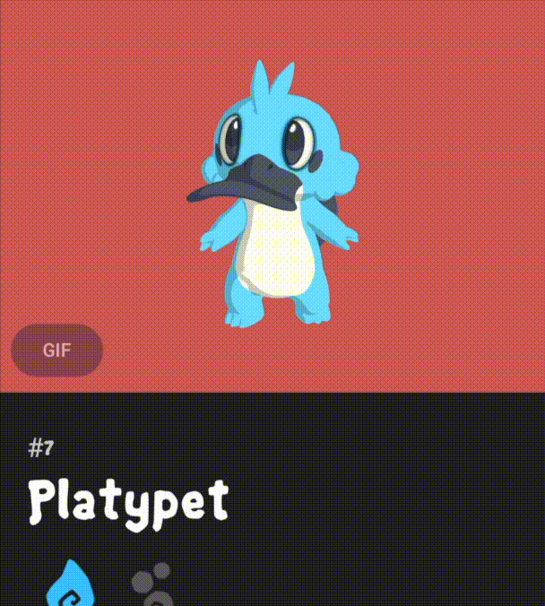
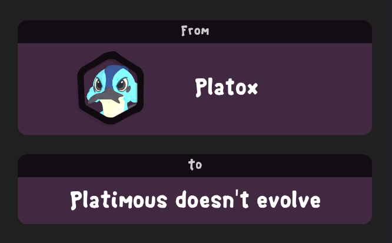

   
# Tempedia

**Your Comprehensive Temtem Encyclopedia**

 

## Description

Tempedia is a detailed encyclopedia that contains information about every Temtem present in the Airborne Archipelago. Quickly access vital details about each creature, including their stats, types, techniques, evolutions, and locations. Whether you're a seasoned Tamer or just starting your adventure, Tempedia is your go-to resource for all things Temtem.

 

## Key Features

*   **Browse Temtem:** Easily browse through all Temtem by name and/or type.
*   **Detailed Temtem Information:**
    *   **Stats:** View comprehensive stats for each Temtem, including HP, STA, ATK, DEF, SPATK, SPDEF, and SPD.
    *   **Types:** Discover the elemental types of each Temtem and their strengths and weaknesses.
    *   **Techniques:** Explore the full list of techniques a Temtem can learn, including their type, category, stamina cost, hold turns, priority, damage, and description.
    *   **Evolutions:** Understand how each Temtem evolves, including the number of levels required or other special conditions.
    *   **Evolution Tree:** Visualize the complete evolution path of each Temtem, from it's initial form to it's final stage.
    *   **Locations:** Find out where each Temtem can be found in the Airborne Archipelago.

 

## Screenshots/GIFs

<!-- Loading Screen -->
*   **Loading Screen:**

    

<!-- Temtem List -->
*   **Temtem List:**

    
    

    
    
    

<!-- Temtem Details - Basic Info -->
*   **Temtem Details - Basic Info:**

<table>
  <tr>
    <td align="center"></td>
    <td align="center"></td>
  </tr>
</table>

<!-- Temtem Details - Stats -->
*   **Temtem Details - Stats:**

    

<!-- Temtem Details - Techniques -->
*   **Temtem Details - Techniques:**

    
    

<!-- Temtem Details - Evolutions -->
*   **Temtem Details - Evolutions:**

    

    
	
    

*   **Temtem Details - Locations (Coming Soon):**

<!--
 

## Installation/Setup

*(This section will be updated once the GitHub Actions workflow is set up and the app is ready for distribution.)*

1.  **APK Generation:** A GitHub Actions workflow will be set up to automatically generate an APK file for each release.
2.  **Play Store:** The app will be available for download on the Google Play Store.
3. **Manual installation:** You can download the apk from the releases section.
-->

 

## Usage

Tempedia is designed to be intuitive and easy to use. Here's a quick guide to get you started:

1.  **Browsing Temtem:**
    * Upon launching the app, you'll be presented with a list of all Temtem.
    * Scroll through the list to view the available Temtem.
2.  **Searching and Filtering:**
    * Use the search bar at the top of the screen to quickly find a specific Temtem by name.
    * Filter the list by Temtem type to narrow down your search.
3.  **Viewing Temtem Details:**
    * Tap on a Temtem from the list to view it's detailed information.
    * Use the navigation buttons at the top of the screen to switch between the different sections: Stats, Techniques, Evolutions, and Locations.
4. **Techniques:**
    * In the techniques section, you can see the techniques that the Temtem can learn.
    * Tap on a technique to see more details.
5. **Evolution:**
    * In the evolutions section, you can see the evolution path of the Temtem.
    * Also, you can see the evolution tree of the Temtem.
6. **Locations (Coming Soon):**
    *   In the locations section, you'll find a list of areas where the Temtem appears.
    *   Tap on the "Show Map" button to view a detailed map of the location, highlighting the Temtem's habitats.
    *   *(Note: This feature is currently under development and will be available in a future update.)*

 

## Contact

For any questions, feedback, or suggestions, please feel free to contact me at my [Email](mailto:l.delaiglesia@hotmail.com) or my [Linkedin](https://www.linkedin.com/in/lucianodelaiglesia/).

 

## Attribution

This app uses data from the [Temtem API](https://Temtem-api.mael.tech/). Made by:  

 

## Under Development

Please note that this app is currently under development. Features and functionality are subject to change.
